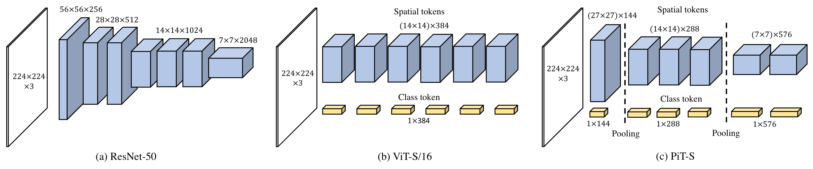

## Accepted to ICCV 2021 !!

## Rethinking Spatial Dimensions of Vision Transformers

**Byeongho Heo, Sangdoo Yun, Dongyoon Han, Sanghyuk Chun, Junsuk Choe, Seong Joon Oh** | [Paper](https://arxiv.org/abs/2103.16302)

NAVER AI LAB

</img>

### News

- **Mar 30, 2021**: Code & paper released
- **Apr 2, 2021**: PiT models with pretrained weights are added to [timm repo](https://github.com/rwightman/pytorch-image-models/blob/master/timm/models/pit.py). You can directly use PiT models with `timm>=0.4.7`.
- **Jul 23, 2021**: Accepted to ICCV 2021 as a poster session

### Abstract
Vision Transformer (ViT) extends the application range of transformers from language processing to computer vision tasks as being an alternative architecture against the existing convolutional neural networks (CNN). Since the transformer-based architecture has been innovative for computer vision modeling, the design convention towards an effective architecture has been less studied yet. From the successful design principles of CNN, we investigate the role of the spatial dimension conversion and its effectiveness on the transformer-based architecture. We particularly attend the dimension reduction principle of CNNs; as the depth increases, a conventional CNN increases channel dimension and decreases spatial dimensions. We empirically show that such a spatial dimension reduction is beneficial to a transformer architecture as well, and propose a novel Pooling-based Vision Transformer (PiT) upon the original ViT model. We show that PiT achieves the improved model capability and generalization performance against ViT. Throughout the extensive experiments, we further show PiT outperforms the baseline on several tasks such as image classification, object detection and robustness evaluation.


## Model performance

We compared performance of PiT with DeiT models in various training settings. Throughput (imgs/sec) values are measured in a machine with single V100 gpu with 128 batche size.

| Network        |  FLOPs  | # params | imgs/sec | Vanilla | +CutMix | +DeiT | +Distill |
|----------------|:-------:|:--------:|:--------:|:--------:|:--------:|:--------:|:--------:|
| DeiT-Ti |  1.3 G | 5.7 M | 2564 | 68.7   | 68.5 | 72.2  | 74.5 |
| PiT-Ti |  0.71 G | 4.9 M | 3030 | 71.3 |  72.6 | 73.0 | 74.6 |
| PiT-XS |  1.4 G | 10.6 M | 2128 | 72.4 | 76.8  | 78.1 | 79.1 |
| | | | | | | | |
| DeiT-S |  4.6 G | 22.1 M | 980 | 68.7   | 76.5 | 79.8  | 81.2 |
| PiT-S |  2.9 G | 23.5 M | 1266 | 73.3   | 79.0 | 80.9 | 81.9 |
| | | | | | | | |
| DeiT-B |  17.6 G | 86.6 M | 303 | 69.3   | 75.3 | 81.8  | 83.4 |
| PiT-B |   12.5 G | 73.8 M | 348 | 76.1  | 79.9 | 82.0 | 84.0 |


## Use PiT models with timm repo

Install `timm>=0.4.7` using:
```
pip install git+https://github.com/rwightman/pytorch-image-models.git
```

Create PiT models
```Python
import torch
import timm

model = timm.create_model('pit_s_224', pretrained=True)
print(model(torch.randn(1, 3, 224, 224)))
```

## Pretrained weights

| Model name   |  FLOPs  | accuracy  | weights |
|:-------:|:--------:|:--------:|:--------:|
| `pit_ti` |  0.71 G | 73.0 | [link](https://drive.google.com/file/d/17BS8UamKhZBq_-0PfSls6U0Pp8Tmree0/view?usp=sharing) |
| `pit_xs` |  1.4 G | 78.1 | [link](https://drive.google.com/file/d/1F7x2owp7frFJoyojoF80L7yB-DA9jhmi/view?usp=sharing) |
| `pit_s` |  2.9 G | 80.9 | [link](https://drive.google.com/file/d/1shVYwAmYesWioca7NiDM2ESrZYEjZsaG/view?usp=sharing) |
| `pit_b` |   12.5 G | 82.0 | [link](https://drive.google.com/file/d/1whd2saHjELyj6ESdkXSD1x8mMMYrRGNV/view?usp=sharing) |
| | | | |
| `pit_ti_distilled` | 0.71 G | 74.6 | [link](https://drive.google.com/file/d/1dszOX9nvHcNuuY5a9_dUAYVxhQWcDK2c/view?usp=sharing) |
| `pit_xs_distilled` | 1.4 G | 79.1 | [link](https://drive.google.com/file/d/1C_C_F40-VEhk23xuvl2qwlocDHutOw30/view?usp=sharing) |
| `pit_s_distilled` | 2.9 G | 81.9 | [link](https://drive.google.com/file/d/15fQvnjii-vpsFk1iaF0TVIw4gyyGXc09/view?usp=sharing) |
| `pit_b_distilled` | 12.5 G | 84.0 | [link](https://drive.google.com/file/d/1JOk63pIj6OxW0R93TiIizcb5VIc-HNML/view?usp=sharing) |


## Dependancies
Our implementations are tested on following libraries with Python 3.6.9 and CUDA 10.1. 
```
torch: 1.7.1
torchvision: 0.8.2
timm: 0.3.4
einops: 0.3.0
```

Install other dependencies using the following command.
```bash
pip install -r requirements.txt
```

## How to use models

You can build PiT models directly

```Python
import torch
import pit

model = pit.pit_s(pretrained=False)
model.load_state_dict(torch.load('./weights/pit_s_809.pth'))
print(model(torch.randn(1, 3, 224, 224)))
```

Or using `timm` function

```Python
import torch
import timm
import pit

model = timm.create_model('pit_s', pretrained=False)
model.load_state_dict(torch.load('./weights/pit_s_809.pth'))
print(model(torch.randn(1, 3, 224, 224)))
```

To use models trained with distillation, you should use `_distilled` model and weights.


```Python
import torch
import pit

model = pit.pit_s_distilled(pretrained=False)
model.load_state_dict(torch.load('./weights/pit_s_distill_819.pth'))
print(model(torch.randn(1, 3, 224, 224)))
```


## License

```
Copyright 2021-present NAVER Corp.

Licensed under the Apache License, Version 2.0 (the "License");
you may not use this file except in compliance with the License.
You may obtain a copy of the License at

    http://www.apache.org/licenses/LICENSE-2.0

Unless required by applicable law or agreed to in writing, software
distributed under the License is distributed on an "AS IS" BASIS,
WITHOUT WARRANTIES OR CONDITIONS OF ANY KIND, either express or implied.
See the License for the specific language governing permissions and
limitations under the License.
```

## Citation

```
@inproceedings{heo2021pit,
    title={Rethinking Spatial Dimensions of Vision Transformers},
    author={Byeongho Heo and Sangdoo Yun and Dongyoon Han and Sanghyuk Chun and Junsuk Choe and Seong Joon Oh},
    booktitle = {International Conference on Computer Vision (ICCV)},
    year={2021},
}
```
